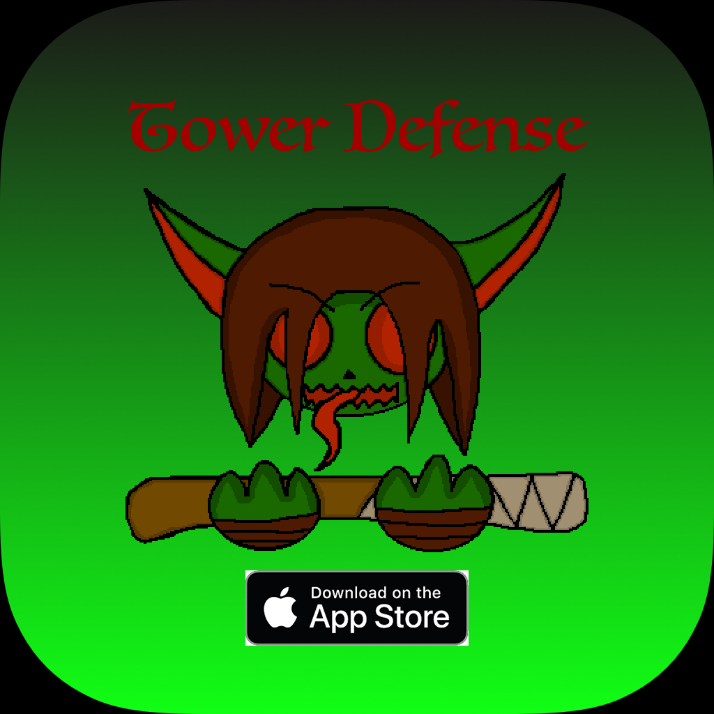

# IOS-Portfolio-Brown22

# New to Github
Contributed to new projects for the EPHS IOS team.
# New to Xcode
Learned basic principles of Xcode to make IOS apps and had collaboration with 
EPHS IOS team members to create projects. Worked with processing and managing assets for our IOS game [Tower Defense](https://github.com/EPHS-iOS/Tower-Defense)
# New to Sketch
Developed skills in designing assets like our stickers in EPHS stickers and IOS app icons. 
Here is a sticker I worked on for our school and the app Icon I made for our game

* Links to Projects I worked on in IOS app development
  * [Timescope](https://github.com/ElliottB678/blockstock)
  * [EPHS IOS stickers](https://github.com/EPHS-iOS/Stickers)
  * [Tower Defense](https://github.com/EPHS-iOS/Tower-Defense)

