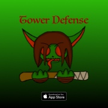

# IOS-Portfolio-Brown22

## New to Github
Contributed to new projects for the EPHS IOS team.
## New to Xcode
Learned basic principles of Xcode to make IOS apps and had collaboration with 
EPHS IOS team members to create projects. Worked with processing and managing assets for our IOS game [Tower Defense](https://github.com/EPHS-iOS/Tower-Defense)
## New to Sketch
Developed skills in designing assets like our stickers in EPHS stickers and IOS app icons. 
Here is a sticker I worked on for our school and the app Icon I made for our game and also my Timescope app Icon.

## My take away from this course
I learned how to collobrate with creators on Xcode and Sketch projects using Github. I learned how to design and integrate assets into Xcode projects and build Icons for IOS apps. I learned how to market and find target audiences for apps using personas, learning the ins and outs of the App store advertising, and incorporating features users want in their apps. I also learned how to design User Interface ideas and integrate them into SwiftUI.

## What will I continue after this course?
I plan to learn more about Xcode using SwiftUI and fully develop my User Interface ideas in apps like Timescope.

* Links to Projects I worked on in IOS app development
  * [Timescope](https://github.com/ElliottB678/blockstock)
  * [EPHS IOS stickers](https://github.com/EPHS-iOS/Stickers)
  * [Tower Defense](https://github.com/EPHS-iOS/Tower-Defense)

